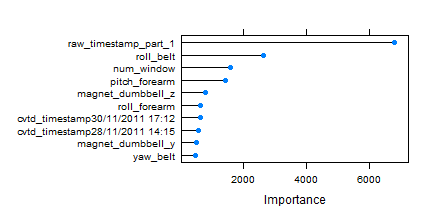

#### Executive Summary

Human Activity Recognition - HAR - has emerged as a key research area in the last years and is gaining increasing attention by the pervasive computing research community, especially for the development of context-aware systems. There are many potential applications for HAR, like: elderly monitoring, life log systems for monitoring energy expenditure and for supporting weight-loss programs, and digital assistants for weight lifting exercises.

The objective of this report is to establish a classfier to predict different classe types based on data collected from mobile devices.


---

#### Data Exploration and Cleaning
First of all, we need to do some data exploration works and clean the datasets. 
Here we detect the null values of each variable and find there are a bunch of columns have over 95% NA values which is too big to make the imputation. So we decide to delete those columns directly.
Then we also test the non zero vairable and delete the Id and usernames columns which we think are meaningless to the model.
At last we get a clean training set which contains 19622 observations and 57 variables for modeling task.


```r
# load data
train <- read.table('data/pml-training.csv', stringsAsFactor=F, sep=','
                    ,header = T,na.strings = c("NA",""))
# detect the NA percent of each column
na_train <- sapply(1:length(names(train)), function(i, na_base=c()){
    na_col <- mean(is.na(train[i]))
    na_base <- c(na_base, na_col)})
names(na_train) <- names(train)
# eliminate the column with over 50% NA value
na_index <- na_train < .5
train2 <- train[,na_index]
train2 <- train2[,-c(1, 2)]
# non zero variable
nzv <- nearZeroVar(train2,saveMetrics = F)
training <- train2[,-nzv]
dim(training)
```

```
## [1] 19622    57
```

---

#### Modeling
Then, we choose gbm with cross validation to do the modeling work. So we can avoid the overfitting problem to some extent. 
We also split the raw datasets into training and testing parts so we can measure the out of sample error later.
After modeling, we first apply our model to training set and we can see the confusion matrix has revealed that the model can perfectly classify all five classes based on training dataset. The sensitivity and specificity for all classes are 100%. For now, the classifer looks prety good. 
Following plot also indicates the top 10 important variables to predict different classes of users.


```r
set.seed(888)
# split train and test
index <- createDataPartition(training$classe, p=0.8, list=F)
train_md <- training[index,]
test_md <- training[-index,]
# modeling
fitControl <- trainControl(method = "cv",number = 10)
gbmGrid <-  expand.grid(interaction.depth = 5, n.trees = 300, shrinkage = 0.1)
fit<- train(as.factor(classe)~., data=train_md, method = 'gbm', trControl=fitControl, tuneGrid = gbmGrid, verbose=F)
gbmImp <- varImp(fit,scale=F)
plot(gbmImp, top=10)
```

 

---

#### Out of Sample Error
Here we can compare the differences between in sample error and out of sample error. The report results are from known and unknown datasets to our model. 
From confusionMatrix function, we find when we apply the model to a new dataset, there are 5 wrong predictions apear in Class B and C. and the accuracy decrease slightly to 99.87%. So we expect the out of sample error to be around 0.04% to 0.3%.
We also trianed a model without cross validation which results in a higher out-of-sample-error.
So we can conclude that cross validation can help overfitting to some extent because the out-of-sample-error of our model is lower than the model without cross validation. 
Following is the results of our model.


```r
pred <- predict(fit, train_md)
result <- confusionMatrix(pred, train_md$classe)
pred_t <- predict(fit, test_md)
result_t <- confusionMatrix(pred_t, test_md$classe)
result_t
```

```
## Confusion Matrix and Statistics
## 
##           Reference
## Prediction    A    B    C    D    E
##          A 1116    1    0    0    0
##          B    0  758    0    0    0
##          C    0    0  684    0    0
##          D    0    0    0  643    0
##          E    0    0    0    0  721
## 
## Overall Statistics
##                                     
##                Accuracy : 1         
##                  95% CI : (0.999, 1)
##     No Information Rate : 0.284     
##     P-Value [Acc > NIR] : <2e-16    
##                                     
##                   Kappa : 1         
##  Mcnemar's Test P-Value : NA        
## 
## Statistics by Class:
## 
##                      Class: A Class: B Class: C Class: D Class: E
## Sensitivity             1.000    0.999    1.000    1.000    1.000
## Specificity             1.000    1.000    1.000    1.000    1.000
## Pos Pred Value          0.999    1.000    1.000    1.000    1.000
## Neg Pred Value          1.000    1.000    1.000    1.000    1.000
## Prevalence              0.284    0.193    0.174    0.164    0.184
## Detection Rate          0.284    0.193    0.174    0.164    0.184
## Detection Prevalence    0.285    0.193    0.174    0.164    0.184
## Balanced Accuracy       1.000    0.999    1.000    1.000    1.000
```


---

#### Prediction
After test the model on training data. Then we will apply the classifier to test datasets.
First, we load the test dataset and do the exactly same preprocess works as we've done on training dataset. Then we apply the classifier on it and get the results as following. 


```r
test <- read.table('data/pml-testing.csv', stringsAsFactor=F, sep=','
                    ,header = T,na.strings = c("NA",""))
# test2 <- test[,na_index]
# testing <- test2[,-nzv]
pred_test <- predict(fit, newdata=test)
results <- data.frame(test$problem_id, test$user_name, pred_test)
names(results) <- c('Problem_id','User_name','Classe')
results
```

```
##    Problem_id User_name Classe
## 1           1     pedro      B
## 2           2    jeremy      A
## 3           3    jeremy      B
## 4           4    adelmo      A
## 5           5    eurico      A
## 6           6    jeremy      E
## 7           7    jeremy      D
## 8           8    jeremy      B
## 9           9  carlitos      A
## 10         10   charles      A
## 11         11  carlitos      B
## 12         12    jeremy      C
## 13         13    eurico      B
## 14         14    jeremy      A
## 15         15    jeremy      E
## 16         16    eurico      E
## 17         17     pedro      A
## 18         18  carlitos      B
## 19         19     pedro      B
## 20         20    eurico      B
```

---

Thank you for reading!
Tianxiang Liu
